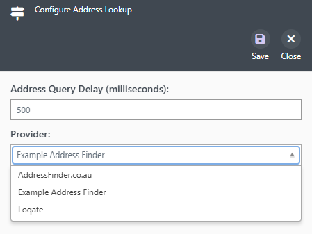
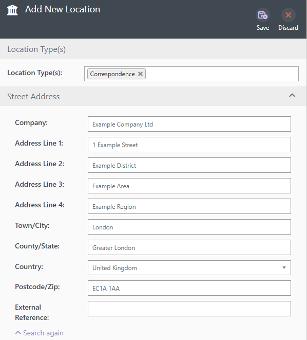

# Address Finder

This is a working sample of a custom Address Lookup Provider.

This is commonly used to search a third-party address/geocoding service for addresses when populating an ODS location.

# Files

| File  | Purpose  |
|---|---|
| `AddressFinderSearchProvider.cs`  | This is the provider implementation. It is responsible for calling the third-party system and collating the results  |
| `AddressFinderSearchProviderConfig.cs`  | This is the model representing any custom configuration needed for the provider  |
| `./_Content/AddressFinder/addressFinder.widget.json`  | Registers the configuration widget. Its `id` (`ExamplePlugin.AddressFinder`) must match the provider's `ConfigWidget`  |
| `./_Content/AddressFinder/widget.js`  | The configuration widget view model (`load`/`save`/`validationErrorCount`)  |
| `./_Content/AddressFinder/widget.html`  | The configuration widget template (the `Result Prefix` field)  |

# The Provider Contract (`IAddressLookupProvider`)

| Member | Purpose |
|---|---|
| `SystemName` / `DisplayName` | Identify the provider in configuration |
| `ConfigWidget` | The id of the custom configuration **widget** (see `./_Content/AddressFinder`). The 'Address Lookup' feature embeds this widget inline via `$ui.widgets.loadWidget` when the provider is selected - it is not opened as a stack panel. The id must match the `id` in `addressFinder.widget.json`. |
| `SearchAddresses(term, config)` | Return a list of `AddressSummary` suggestions matching the search term |
| `GetAddressById(id, config)` | Expand a selected summary into a full `AddressDetail` |
| `Geocode(location, country, config)` | Resolve a free-text location to a `GeocodeDetail` (coordinates) |

The `config` argument on every call is the JSON produced by the configuration widget
(the object returned from `widget.js`'s `save()`), deserialised into
`AddressFinderSearchProviderConfig`. In this sample that config exposes a single
`ResultPrefix` field, which every provider method prepends to its result — the street
address of each `SearchAddresses` suggestion, the `AddressLine1` of the expanded
`GetAddressById` detail, and the `Name` returned by `Geocode` — so you can see the saved
config reaching each endpoint.

The widget is a plain view model driven by the host blade: it constructs the widget,
calls `load(config)` to populate the UI, reads `validationErrorCount()` to enable/disable
its Save button, and calls `save()` to get the object to persist. There is no modal
header, ribbon or `$ui.stacks` call in the widget - the blade owns that chrome.

This sample returns hard-coded results — replace the bodies with real calls to your
address/geocoding service (use the injected `ICoreHttpRetryClient` for HTTP):

- `SearchAddresses` returns `AddressSummary` items (`Udprn`, `StreetAddress`, `Place`).
- `GetAddressById` returns a fully populated `AddressDetail`.
- `Geocode` returns a `GeocodeDetail` (`Name`, `Latitude`, `Longitude`).

# How To Setup The Provider

The provider will appear in 'Global Features' under the 'Address Lookup' feature.

1. Open the feature and select 'Example Address Finder' as the address lookup provider.

   Its custom configuration widget appears inline as follows :-

   

2. Enter some text into the 'Result Prefix' box, then Save.

# How To Use The Provider

1. Add a new location (e.g. for a People or Organisation entry).

2. Select location type that has an address entry option.

3. Enter some text in the Find Address box and select the option presented.

4. The Address fields will be populated with the hardcoded content.

   The provider returns a single suggestion (`1 Example Street`), prefixed with the text 
   we entered in our custom configuration (step 2). Selecting it calls `GetAddressById` to
   expand the suggestion into the full address — each line carries the same prefix — and 
   `Geocode` resolves any free-text location to coordinates (also prefixed), confirming
   the saved config reaches every endpoint.

   
